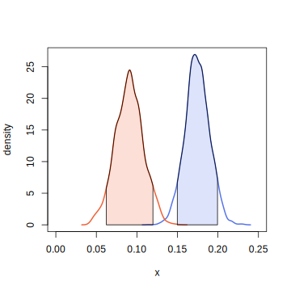

# bayesutils
This R package offers a lightweight set of tools for working with posterior draws from Markov Chain Monte Carlo (MCMC) samplers and associated Stan code. It provides 

- flexible, interface-agnostic utilities for 
- extracting, 
- transforming, 
- comparing, 
- and visualizing parameter draws, 
- as well as performing prior and posterior predictive simulations.

The package is designed to complement existing tools such as `CmdStanR` and `rstanarm`, as well as the widely-used `rethinking`package, addressing common workflow gaps in Bayesian modeling. While still a work in progress, it aims to support both teaching and research use cases by streamlining analysis across various Stan-based interfaces.

## Installation

This package is not on CRAN. Instead you can install it directly from GitHub. Yet some additional packages are required (some you might have already installed). 

```
install.packages(
    "Cairo",
    "cmdstanr",
    "coda",
    "jsonlite",
    "posterior",
    "rstan",
    "stringr")
devtools::install_github("HeineConK/bayesutils")
```

## Some Functionality demonstrated

To showcase some of the package features, let's consider the Palmer penguins dataset. This table holds data for 333 penguins recorded near Palmer Station, Antarctica. We shall explore how ``bayesutils`` can support building a statistical model for infering penguin log-body mass, and how MCMC draws can be analyzed.   

We start off by retrieving the data (f.e. by means of the ``palmerpenguins`` package). 


```
library(palmerpenguins)
library(dplyr)
d <- penguins %>% na.omit %>% mutate(
  log.bm.kg = log( body_mass_g / 1000 ),
  bl.cm = bill_length_mm / 10
)
```

### Structured Composing of Stan Code

Next we want to build a simple linear regression model in Stan for log-body mass prediction with bill length, sex and species as covariates. Now imagine you are in the spot where you have to teach the model step-by-step, or manage multiple modelling ideas. Here the `bayesutils` idea provides a simple workflow, where single Stan code components are composed into one functioning Stan program. 

In this example, we define the following Stan code for the model block only:

```
cdat <- "
  int N;
  // predictors
  array[N] int sex; // 1: fem, 2: male
  array[N] int spec; // 1: Adel, 2: Chin, 3: Gent
  vector[N] l; // bill length (cm)

  // outcome
  vector[N] m; // log-body mass (kg)
"
```
Imagine this beaing a code chunk in a notebook, giving detailed explanations to students on what is going on in the code.

In this fashion we continue by writing the model block:


```
cmdl <- "
  for(k in 1:3) B[k,] ~ normal(0, 1);
  a ~ normal(0, 1);
  sigma ~ exponential(1);
  for(i in 1:N) m[i] ~ normal( B[ spec[i], sex[i]] + a * l[i], sigma  );
"
```

(Imagine here yourself writing notes or talking to students.)

Finally, the parameters block:

```
cpar <- "
  matrix[ 3, 2 ] B;
  real a;
  real<lower = 0> sigma;
"
```

Then we compose the full Stan program from these blocks:

```
code <- stancode( cdat, cpar, cmdl )
```

To get the model to run, it is best to write it to a file and invoke the Stan C++ toolchain to do its magic.

```
sc.to.stan.file("peng.stan", code = code)

library("cmdstanr")
m <- cmdstan_model("peng.stan")
```

Note, that `sc.to.stan.file` calls ``rstans`` pre-compiler for syntax checking. If there are any syntax errors in your code, you'd be informed.

Next, we aggregate the needed data and start the sampler:

```
dat <- list(
  N = nrow(d),
  sex = as.numeric(d$sex),
  spec = as.numeric(d$species),
  l = d$bl.cm,
  m = d$log.bm.kg
)

fit <- m$sample(data = dat, parallel_chains = 2)
```

### Monitoring the sampling process


The HMC sampler finished quickly in the previous example. But now imagine that, given some other model to fit, sampling is slow -- very slow. This could be due to 1. simply a lot of data to process for each sampling iteration 2. non-optimal code, or 3. a mix of reasons including model misspecification and non-identifiability. The latter are most concerning, as they result in pathological chain dynamics and poor sampling. Anyway as a user you can't tell which one of the reasons might be the case until sampling is finished and you go through your post-sampling diagnostics checklist; unless you inspect the draws log files which are continuously saved while sampling. And that's exactly what the following wrapper function does, by providing traceplot visualizations of the ongoing sampling process:


``` 
fit <- sample.with.monitor( m, dat, 
	parallel_chains = 2, 
	chains = 2)
``` 


Notice that a folder and an R script is produced in your working directory. The folder holds draw files while the R script takes care of rendering continously updated traceplots that are then pushed to your webrowser--while the sampler is still going. 

Since sampling happens so quickly in this example, the monitor might not start-up and get to a refresh cycle before the sampler is already finished. Thus try the following code with increased iteration numbers, the `save_warmup` option enabled and `adapt_delta` set to an overly causious value, just for putting the brakes on artificially. This should give the monitor some time to load and to demonstrate some refresh cycles.

``` 
fit <- sample.with.monitor( m, dat, 
	parallel_chains = 2, 
	chains = 2, 
	iter_sampling = 5000,
	iter_warmup = 5000,
	save_warmup = T,
	adapt_delta = 0.999)
``` 


<div align="center">
  
  <br/>
  <em>Browser view on parameter sample traceplots, frequently updated while the sampler continues.</em>
</div>

</br>
This monitoring mechanism still needs a lot of polishing, but it can already aid as an "early warning system".


### Producing Posterior Summaries and Visualizations

We next generate some summary statistics and visualizations from draws obtained in the previous example. Of course, one would now check diagnostics first, but this is dependend of your personal workflow.

```
fit$diagnostic_summary()
fit$summary()
fit
bayesplot::mcmc_trace(fit$draws())

```

``bayesutils`` has some summary stats generating functionality as well.

```
mcmc.summary( fit )
```

```
          mean    sd  median PI50.lwr PI50.upr PI90.lwr
lp__   692.645 2.012 692.970  691.527  694.125  688.928
B[1,1]   0.874 0.065   0.875    0.829    0.918    0.765
B[1,2]   1.028 0.071   1.030    0.980    1.076    0.909
B[2,1]   0.835 0.082   0.837    0.779    0.891    0.698
B[2,2]   0.904 0.089   0.906    0.844    0.964    0.755
B[3,1]   1.129 0.080   1.131    1.075    1.183    0.996
B[3,2]   1.252 0.086   1.254    1.193    1.311    1.109
a        0.091 0.017   0.090    0.079    0.102    0.062
sigma    0.075 0.003   0.075    0.073    0.077    0.070
       PI90.upr
lp__    695.266
B[1,1]    0.980
B[1,2]    1.143
B[2,1]    0.969
B[2,2]    1.052
B[3,1]    1.258
B[3,2]    1.394
a         0.120
sigma     0.080
```

These stats can be quickly visualized in the usual sense:


```
mcmc.forestplot(fit, vlines.at = 0)
```

<div align="center">
  
</div>


Changing the variavble labels gives these inference some context:


```
altnames <- expand.grid( levels(d$sex), levels(d$species)) %>%
  apply(1, paste,simplify = F, collapse = "-") %>%
  unlist() %>%
  c("alpha", "sigma")

mcmc.forestplot(draws, vlines.at = 0,labels = altnames)
```


<div align="center">
  
</div>


Alternatively you can extract the samples from the fit object and use these directly instead:

```
draws <- extract_samples( fit )
```

Users of the `rethinking` package are familiar with the structure of the resulting object, which is a named list of matrices and vectors.

### Comparing Inferences

Continuing from the example, consider a second model which is similar to the first, but only stratifications happens on the level of the sexes. Thus the Stan model block is:

```
cmdl2 <- "
  B ~ normal(0, 1);
  a ~ normal(0, 1);
  sigma ~ exponential(1);
  for(i in 1:N) m[i] ~ normal( B[ sex[i]] + a * l[i], sigma  );
"
```

Notice that `B` is not a matrix anymore. This becomes apparent in the parameters block:

```
cpar2 <- "
  vector[2] B;
  real a;
  real<lower = 0> sigma;
"
```

Since the data block remains unchanged (Stan does not care about unused data), we can compose and compile the model quickly:


```
sc.to.stan.file("peng2.stan", code = code2)
m2 <- cmdstan_model("peng2.stan")

fit2 <- m2$sample(data = dat, parallel_chains = 2)
```

How do the inferences compare to the first model? A quick visualization to put them side by side:

```
mcmc.forestplot( list(fit, fit2), xlim = c(-0.25, 1.5) )

```

<div align="center">
  
</div>


Including labels:

```
mcmc.forestplot( list("Sex+Spec" = fit, "Sex" = fit2), xlim = c(-0.4, 1.5) )

```

<div align="center">
  
</div>

Focusing on parameters present in both models:

```
mcmc.forestplot( list(fit, fit2), vars = c("a", "sigma") )
```


<div align="center">
  
</div>

Currently, the 50%, 90% and 99% credible intervals are shown. This can be quickly modified if needed -- here we tell the plotting function to use 50% and 80% credible intervals instead:

```
piplotter <- PI.boxed.plotter( p = c(0.5, 0.8),
                               col = c(bu.color(2, alpha = 1),
                                       bu.color(2, alpha = 0.5)
                                       )
)

mcmc.forestplot( list(fit, fit2), vars = c("a", "sigma"), pi.plotter = piplotter)

```

<div align="center">
  
</div>


Finally, we visualize the inferences for the predictor coefficient as a density plot, highlighting the non-overlapping 90% credible intervals.

```
plot.dens( draws2$a, col = bu.color(1), xlim = c(0, 0.25))
lines.dens(draws$a, col = bu.color(2))
polyg.intv(x = draws2$a, prob = 0.95, col = acol( bu.color(1) ))
polyg.intv(x = draws$a, prob = 0.95, col = acol( bu.color(2) ))
```

<div align="center">
  
</div>


## Roadmap

As stated earlier, this package is far from being a polished product. Thus there are some feature implementations and refinements to be made in the future. These include:

- sampling monitoring: 
	- replace link list with dropdown menu, since the current solution can quickly clutter the screen when the number of model parameters is large.
	- add option to display histograms including/instead of traceplots. This is of interest f.e. in retrieval testing and calibration checking; as such the monitor can help to detect discrepancies between samples and ground truth early.
	- increase CSV reading speed through dedicated packages. The current base `R` solution can become rather slow with bigger models and large sample numbers.
	- add function argument to specify which parameters to monitor.
- plotting:
	- a lightweight OO design could provide more flexibilty to the user. 
	- maybe moving to ggplot2.
- Stan code handling:
	- export and import, with JSON support
	- provide (teaching) templates 
	
